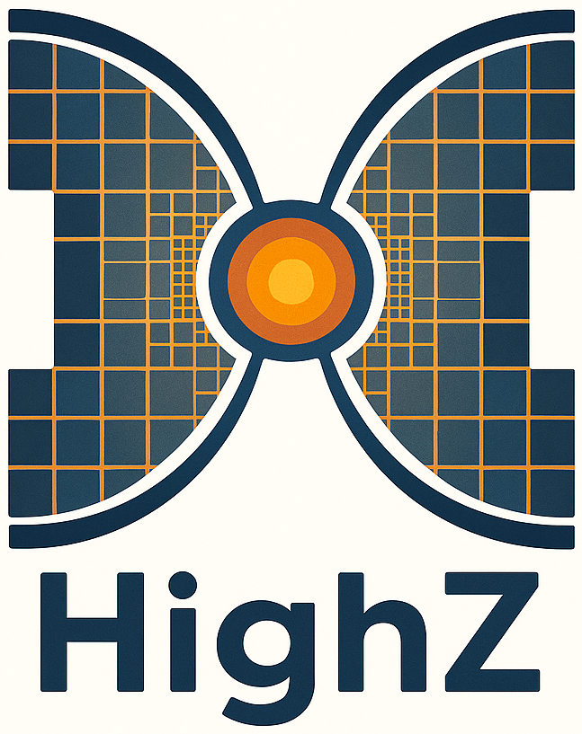

## Highlights

* High-order methods for plasma turbulence
* Multi-physics plasma simulations
* Scientific ML methods for integrated modeling
* Robust sub-grid closures in extended MHD
* Magnetic reconnection for Z-pinch

# Center for High Order Plasma Turbulence Modeling for Z-Pinch (HighZ)

The overarching goal of this PSAAP Focused Investigatory Center (FIC) is to develop high-order numerical methods and scientific ML techniques that will be applied to the modeling and interpretation of plasmas of fluid and fluid-adjacent regimes, with a particular emphasis on turbulence in magnetized plasmas and radiative magnetic reconnection – two areas of fundamental interest to DOE and NNSA, and proxies for a range of plasma phenomena applicable to high energy density physics experiments and fusion energy such as Z pinches. The numerical methods developed will include high-order, positivity-preserving finite difference, finite volume, and discontinuous Galerkin methods for extended magnetohydrodynamics, equipped with novel implicit/semi-implicit time-stepping methods. The scientific machine learning methods we develop will be designed to address the multiscale nature of the targeted plasma applications and will focus on preserving physical structures for enforcing model consistency, extending model reduction techniques to reduce the computational cost in large-scale fluid simulations, and the development of a subgrid model for magnetized turbulence.

## News

Date              | Message
------------------| -----------------------------------------------------------------
02/12/2026        | The story of HighZ center was reported by [MSUToday](https://msutoday.msu.edu/news/2026/02/new-fusion-energy-research-center-engages-students-and-doe) and [DBusiness](https://www.dbusiness.com/daily-news/michigan-state-university-awarded-5m-to-study-fusion-energy/).
01/14/2026        | Congratulations to team member Qi Tang on being selected for the 2025 DOE Early Career Research Program (ECRP).
09/04/2025        | The HighZ project is one of the nine selected PSAAP IV centers. See [announcement](https://www.energy.gov/nnsa/articles/nnsa-announces-selection-next-round-predictive-science-academic-alliance-program) from NNSA.   

  
  
 
   

## HighZ partner universities

&nbsp;

